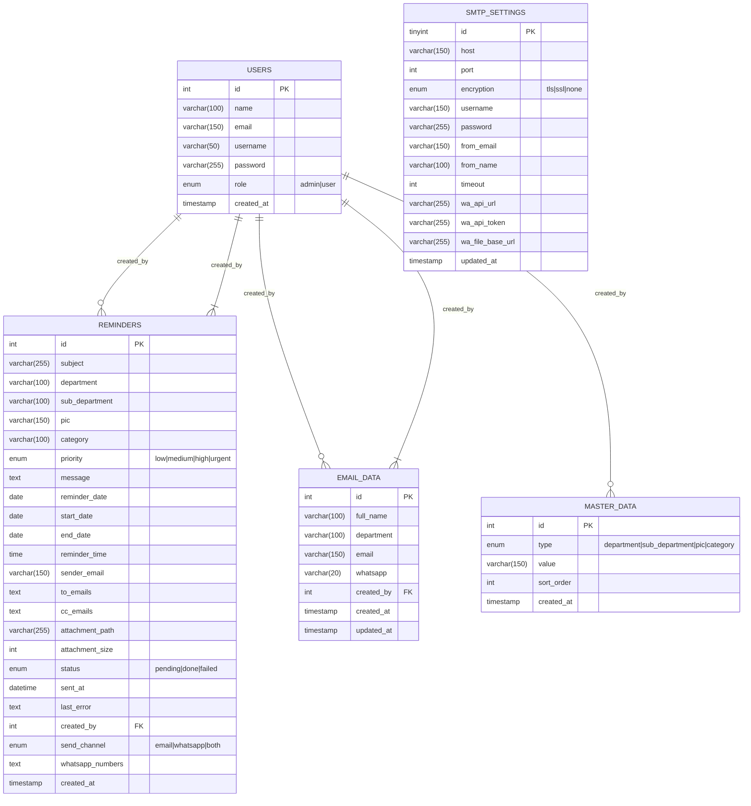

# Database Design / ERD
## App Reminder

## Entity Relationship Diagram



## Table Relationships

```
users (1) ────< reminders (N)     [created_by]
users (1) ────< email_data (N)     [created_by]
users (1) ────< master_data (N)    [created_by] (implicit via role=admin)
```

## Field Details

### reminders.status
| Value | Meaning | Cron Query Logic |
|---|---|---|
| `pending` | Belum dikirim | Dipilih oleh cron query |
| `done` | Terkirim berhasil | Dipilih lagi jika `DATE(sent_at) < CURDATE()` (repeat harian) |
| `failed` | Gagal kirim | Perlu kirim ulang manual |

### reminders.send_channel
| Value | Channel |
|---|---|
| `email` | SMTP email only |
| `whatsapp` | WhatsApp (Fonnte) API only |
| `both` | Email + WhatsApp |

### smtp_settings (Singleton)
Table tunggal dengan `id=1`, diupdate via Settings UI.

### master_data.type
- `department`: Daftar department (HRD, IT, Produksi, dll)
- `sub_department`: Sub-department
- `pic`: Nama PIC
- `category`: Kategori reminder (Meeting, Laporan, Maintenance, dll)

## Indexing

```sql
-- Performance indexes
PRIMARY KEY (id)
KEY fk_reminders_users (created_by)
KEY fk_email_data_users (created_by)
UNIQUE KEY uniq_type_value (type, value)
```

## Schema File
- `appreminder.sql` — contains CREATE TABLE + seed data
- Import via: `mysql -u root -p appreminder < appreminder.sql`
- Seed users: admin/admin123, user/user123
